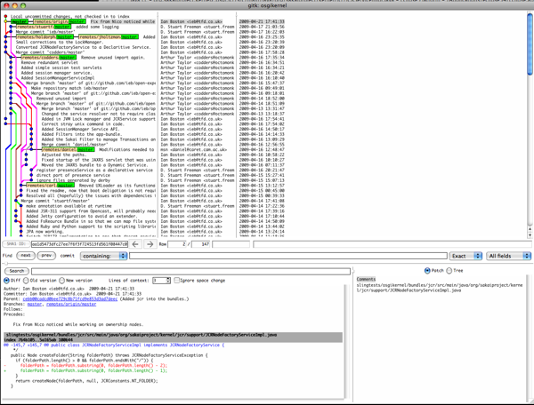

Can start to be a pain, this fetches things a bit faster for review.

```
x43543-2:osgikernel ieb$ git branch -a
* master
  carl/master
  codders/master
  danatcaret/master
  daniel/master
  holdorph/master
  jholtzman/master
  origin/master
  stuartf/integration
  stuartf/master
x43543-2:osgikernel ieb$ for i in `git branch -a | grep '/master' | grep -v origin | cut -f1 -d'/'`; do git fetch $i; done
x43543-2:osgikernel ieb$ gitk -all
```

Which looks like this:


