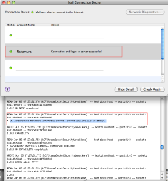

A Self contained James OSGi bundle containing a DNS Server and an IMAP server, binding down to a Sling repository. The screenshot is of OSX iMail connection doctor checking the imap connection and running some simple tests.

