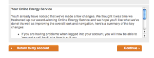
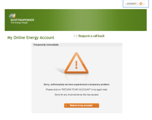
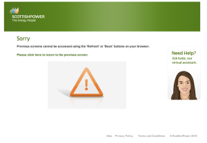

Here is a classic example of new not being better. My utilities provider has a "new and improved interface", so much improved that they felt it necessary to tell their customers how much better it was.

)

If you click on the "Continue" button you find out just how much better it is

)

Hey, fantastic, I can request a call back! But if I press the browser back button, I find the "new and improved site" is even better.

)

I feel so reassured by Katie's smile, I really feel I should ask her for help.

I wonder which numbskull decided to inflict this new and improved user experience on customers without thinking about getting the implementation to work. Made me laugh, hope it does the same for you.
