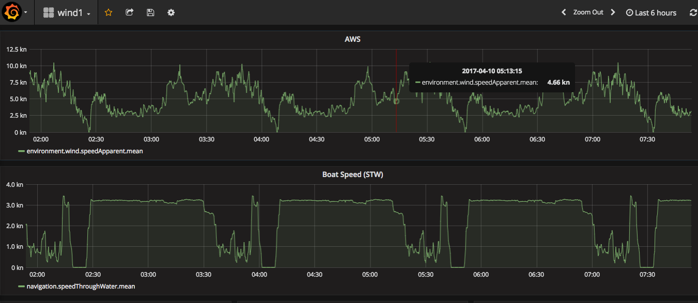
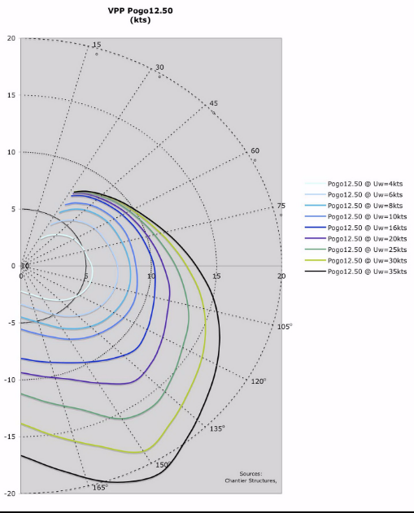

I sail, as many of those who have met me know. I have had the same boat for the past 25 years and I am in the process of changing it. Seeing Isador eventually sold will be a sad day as she predates even my wife. The site of our first date. My kids have grown up on her, strapped into car seats when babies, laughing at their parents soaked and at times terrified (parents that is, not the kids). see <https://hallbergrassy38forsale.wordpress.com/> for info.

The replacement will be a new boat, something completely different. A [Class 40](http://www.class40.com/fr/index/) hull provisioned for cruising. A [Pogo 1250](http://www.finot-conq.com/en/content/pogo-1250). To get the most out of the new boat and to keep within budget (or to spend more on sails) I am installing the bulk of the electronics. In the spare moments I get away from work I have been building a system over the past few months. I want get get the same sort of detailed evidence that I get at work. At work, I would expect to record 1000s of metrics in real time from 1000s of systems. A sailing boat is just as real time, except it's off grid. No significant internet, no cloud, only a limited bank of 12v batteries for power, and a finite supply of diesel to generate electricity, in reality no 240v, but plenty of wind and solar at times. That focuses the mind and forces implementation to be efficient. The budget is measured in Amps or mA as it was for [Apollo 13](https://en.wikipedia.org/wiki/Apollo_13), but hopefully without the consequences.

Modern marine instruments communicate using a variant (NMEA2000) of a CAN Bus present in almost every car for the past 10 years, loved by car hackers. The marine variant, adds some physical standards mostly aimed at easing amatuer installation and waterproofing. The underlying protocol and electrical characteristics are the same as a standard CAN Bus. The NMEA2000 standard also adds message types or PGNs specific to the marine industry. The standard is private, available only to members, but OpenSource projects like [CanBoat](https://github.com/canboat/canboat) on GitHub have reverse engineered most of the messages.

Electrically the CAN Bus is a twisted pair with a 120Ohm resistor at each end to make the pair appear like an infinite length transmission line (ie no reflections). The marine versions of the resistors or terminators come with a marine price tag, even though they often have poor tolerances. Precision 120Ohm resistors are a few pence, and once soldered and encapsulated will exceed any IP rating that could be applied to the marine versions. The Marine bus runs at 250Kb/s slower than many vehicle CAN bus implementations. Manufacturers add their own variants for instances Raymarine SeatalkNG which adds proprietary plugs, wires and connectors.

My new instruments are Raymarine, a few heads and sensors, a chart plotter and an Autopilot. They are basic with limited functionality. Had I added a few 0s to the instrument budget I would have gone for NKE or B&G which have a "Race Processor" and sophisticated algorithms to improve the sensor quality including wind corrections for heal and mast tip velocity, except, the corrections allowed in the consumer versions are limited to a simple linear correction table. I would be really interested to see the code for those extra 0s assuming it's not mostly on the carbon fibre box. This is where it gets interesting for me. In addition to the CanBus project on GitHub there is an excelent [NMEA2000](https://github.com/ttlappalainen/NMEA2000) project targeting Arduino style boards in C++ and [SignalK](https://github.com/SignalK) that runs on Linux. The NMEA2000 project running on an [Aduino Due](https://www.arduino.cc/en/Main/arduinoBoardDue) (ARM-M3 core processor) allows read/write interfacing to the CAN Bus, converting the CAN protocol into a serial protocol that SignalK running on a [Pi Zero W ](https://www.raspberrypi.org/blog/raspberry-pi-zero-w-joins-family/)can consume. SignalK acts as a conduit to an Instance of InfuxDB which captures boat metrics in a time series database. The metrics are then viewed in Grafana in a web browser on a tablet or mobile device.

I mentioned power earlier. The setup runs on the Pi Zero W with a load average of below 1 the board consuming about 200mA (5V). The Arduino Due consumes around 80mA@5V most of the time. There are probably some optimisations on to IO that can be performed in InfluxDB to minimize the power consumption further. Details of setup are in <https://github.com/ieb/nmea2000>. An example dashboard showing apparent wind and boat speed from a test dataset. This is taken from the Pi Zero W.

Remember those expensive race processors. The marketing documentation talks of multiple ARM processors. The Pi Zero W has 1 ARM and the Arduino Due has another. Programmed in C++ the Arduino has ample spare cycles to do interesting things. On sailing boats, performance is predicted by the designer and through experience presented in a polar performance plot.

A polar plot showing expected boat speed for varying true wind angles and speeds. Its a 3D surface. Interpolating that surface of points using bilinear surface interpolation is relatively cheap on the ARM giving me real time target boat speed and real time % performance at a rate of well above 25Hz. Unfortunately the sensors do not produce data at 25Hz, but the electrical protocol is simple. Boat speed is presented as pulses at 5.5Hz per kn and wind speed as 1.045Hz per kn. Wind angle is a sine cosine pair centered on 4V with a max of 6V and a min of 2V. Converting that all that to AWA, AWS and STW is relatively simple. That data is uncorrected. Observing the Raymarine messages with simulated electrical data I found its data is also uncorrected, as the Autopilot outputs Attitude information, ignored by the wind device. I think I can do better. There are plenty of 9DOF sensors (see Sparkfun) available speaking i2c that are easy to attach to an Arduino. Easy, because SparkFun/Adafruit and others have written C++ libraries. 3D Gyro and 3D Acceleration will allow me to correct the wind instrument for wind shear, heal and mast head velocity (the mast is 18m tall, cup anemometers have non linear errors wrt angle of heel). There are several published papers detailing the nature of these errors. I should have enough spare cycles to do this at 25Hz, to clean the sensors and provide some reliable KPIs to hit while at sea.

A longer term projects might be teach a neural net to steer, by letting it watch how I steer, once I have mastered that. Most owners complaining their autopilots can't steer as well as a human. Reinforcement learning in the style of Apha Go could change that. I think I heard the Vendee Globe boats got special autopilot software for a fee.

All of this leaves me with more budget to spend on sails, hopefully not batteries. I will only have to try and remember not to hit anything while looking at the data.
